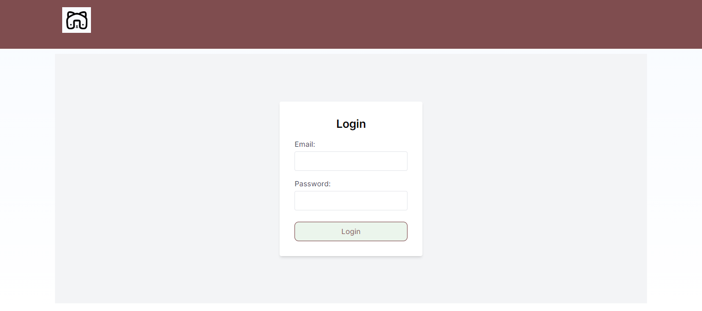
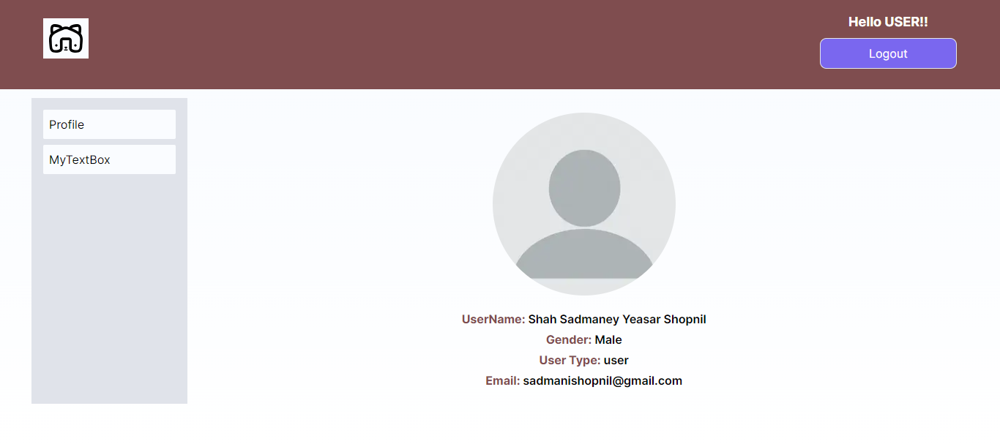
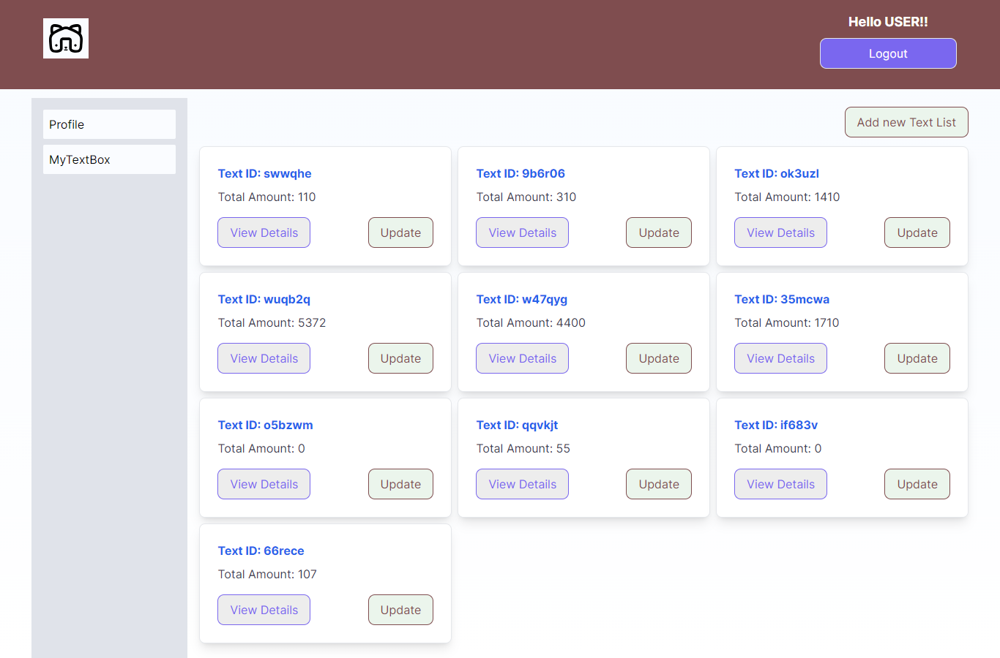
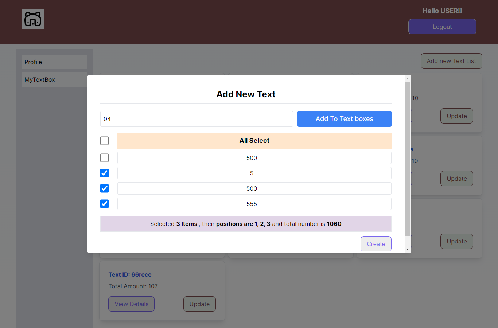
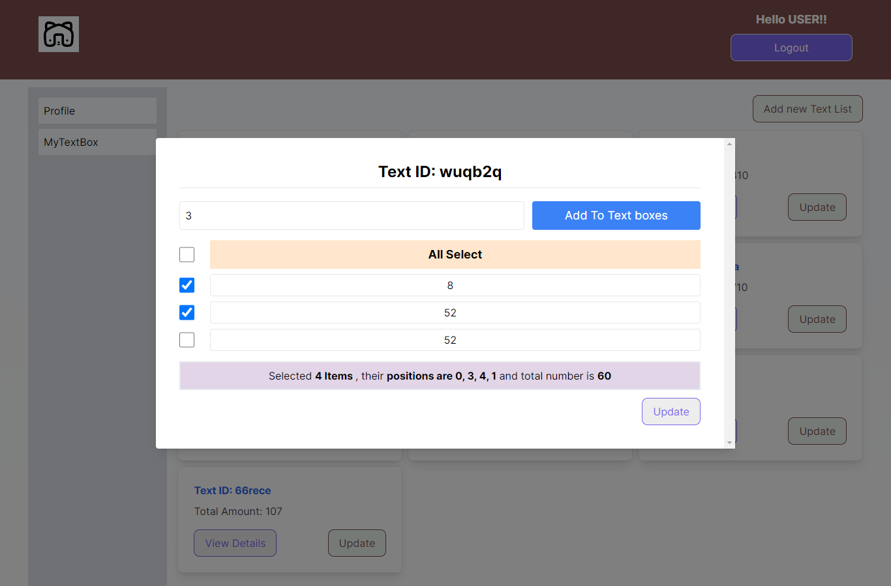
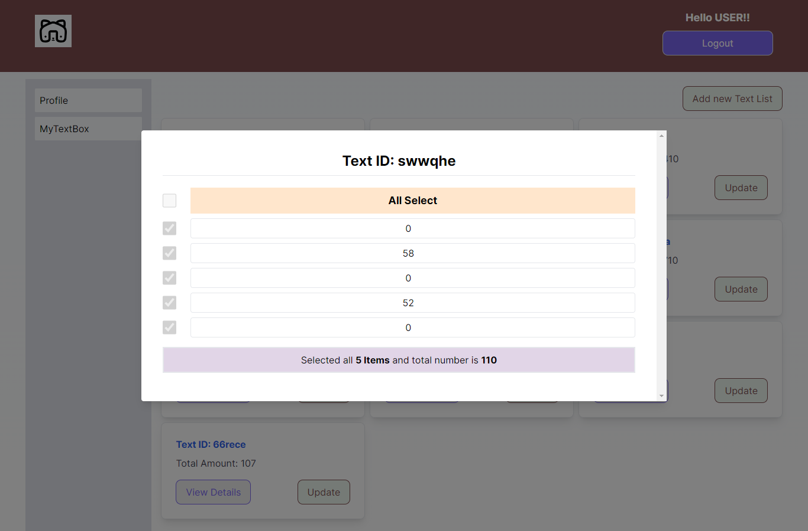

## Key Technologies

**Client-Side:** Next js, TailwindCSS

**Language:** TypeScript

**Test**: Jest

**Documentation**: Lucidchart

## Demo

- **Login page**
  

- **Profile page of User**
  

- **Show All Text Card**
  

- **Add New Text**
  

- **Update existing card element with add new or delete also**

```
  Use Cases
    1. User can update exist element only.
    2. User can update existing one and add more element also.
    3. User can deleted existing one and also can update remains element.

```

  

- **View individual text element details**
  

## Run Locally

Clone the project

```bash
  git clone https://github.com/SYShopnil/Maliha-poly-tex-fiber-industry-limited-task-client.git
```

Go to the project directory

```bash
  cd
  Maliha-poly-tex-fiber-industry-limited-task-client
```

Install dependencies

```bash
  npm install || npm i
```

Get .ENV file

```bash
  cp .env.example .env
```

Start the server

```bash
  npm run dev
```

Start the Test

```bash
  npm run test
```

## Test User

- email: johndoe@gmail.com
- password: 123456789John@

## Support

For support, sadmanishopnil@gmail.com
