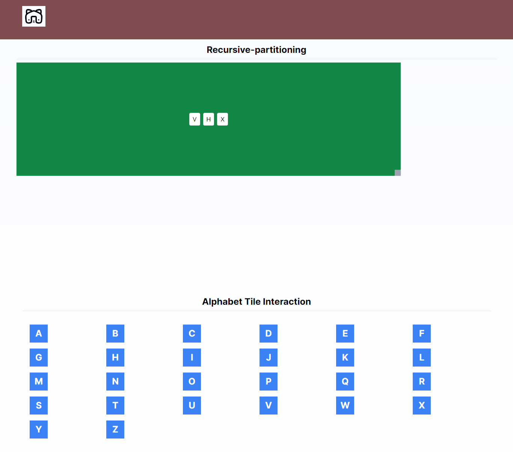
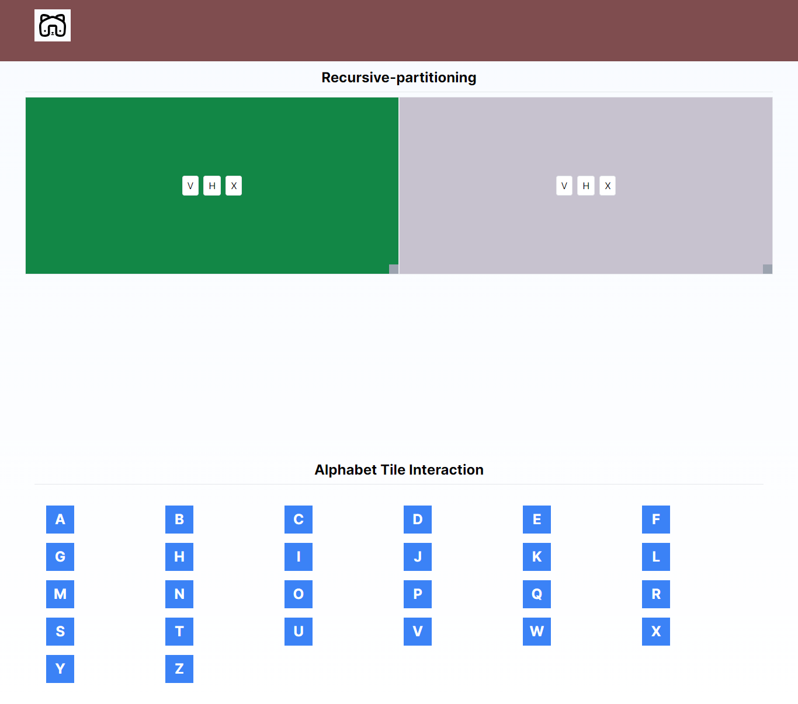
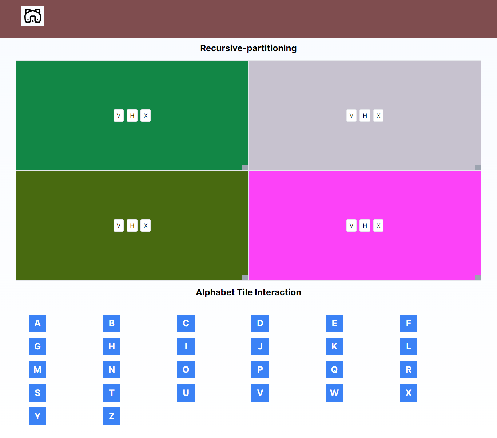
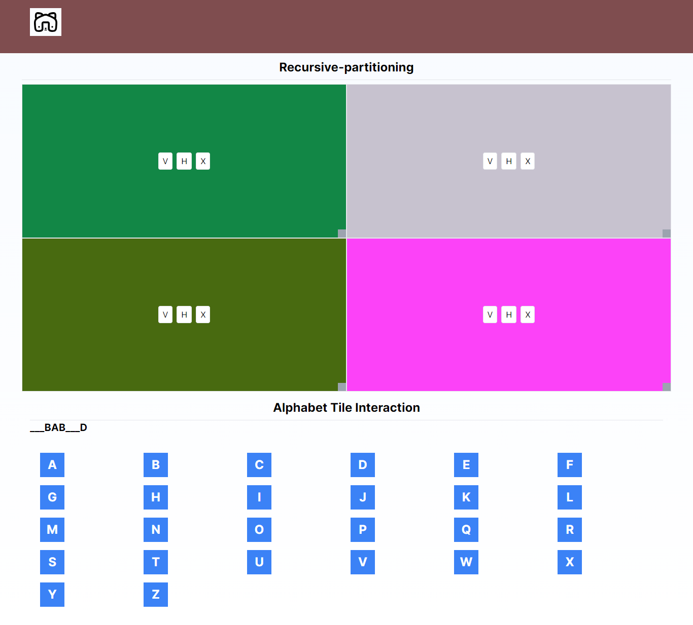

## Key Technologies

**Client-Side:** Next js, TailwindCSS

**Language:** TypeScript

**Test**: Jest

## Demo

- **One(1x1)**
  

- **Two(1x2)**
  

- **Three(1x4)**
  

- **Four(Alphabet)**

```
  Activity
    AAA => ___ and then B become B => ___B

```

  

- **Five(Alphabet)**

```
  Use Cases
    AAABABCCCD => ___BAB___D

```

  

## Run Locally

Clone the project

```bash
  git clone https://github.com/SYShopnil/masterkey-technology-task.git
```

Go to the project directory

```bash
  cd
  masterkey-technology-task
```

Install dependencies

```bash
  npm install || npm i
```

Start the server

```bash
  npm run dev
```

Start the Test

```bash
  npm run test
```

## Support

For support, sadmanishopnil@gmail.com
